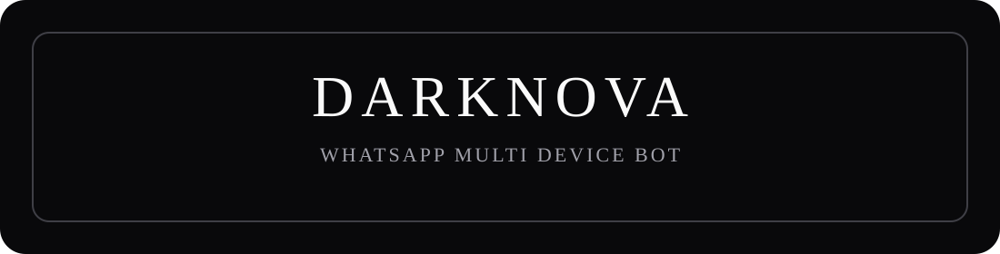

<div align="center">



<h1>DARKNOVA</h1>

<p>A WhatsApp multi-device bot. Pair a number, open the menu, and run it on your own panel.</p>

<p>
  <a href="https://github.com/MrDarkNova/nova-md/stargazers"></a>
  <a href="https://github.com/MrDarkNova/nova-md/network/members"></a>
  <a href="https://github.com/MrDarkNova/nova-md/issues"></a>
  
</p>

</div>

## Deploy

```bash
git clone https://github.com/MrDarkNova/nova-md.git
cd nova-md
Edit `.env` and put the bot number in `BOT_PHONE`.
npm install
npm start
```

On first start the terminal asks who the bot belongs to.

| Choice | What it does |
| --- | --- |
| `1` | Pair the number already in `.env` |
| `2` | Type another number. That number becomes the owner |

The code looks like `ABCD-EFGH`. On the phone: WhatsApp, Linked devices, Link a device, Link with phone number instead.

The bot starts in **private** mode: it only answers the owner (and sudo). Random users get no reply. Send `/mode public` to answer everyone. Send `/mode` with no argument to see the current mode and usage.

## What it can do

| Area | Commands |
| --- | --- |
| Menu | `/menu`, `/setmenu 1`, `/setmenu 2`, `/setmenu 3` |
| Media | `/play`, `/video`, `/tiktok`, `/ig`, `/spotify` |
| Group | `/kick`, `/promote`, `/welcome`, `/antilink`, `/antimedia` |
| Tools | `/removebg`, `/sticker`, `/tts`, `/qr` |
| Owner | `/update`, `/pair`, `/ban`, `/mode` |

`/setmenu` keeps the same box size and changes only the frame.

| Style | Look |
| --- | --- |
| `1` classic | Rounded corners |
| `2` cipher | Book title frame |
| `3` edge | Cut corners |

`/repo` is for the owner. It sends the GitHub preview with stars, forks, language, and the description.

`/update` checks this repo. If nothing changed, it says the bot is up to date and does not restart. Your `.env` and session stay where they are.

## Panel

Use a host that stays online. The startup command is `npm start`. Install `ffmpeg` on the host so audio effects and video conversion can run.

Do not upload `.env` or the `session` folder to GitHub. Those belong to the person who paired the bot.
